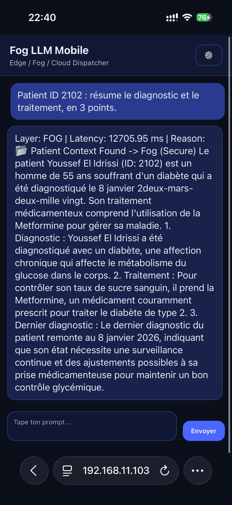
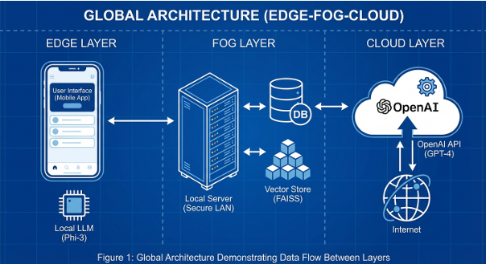

# 🏥 Fog LLM Mobile — Privacy-Aware RAG (Edge / Fog / Cloud)

> **Academic prototype:** a distributed Edge–Fog–Cloud architecture for medical LLM usage with RAG and privacy-first routing.  
> Inspired by *"Dynamic Fog Computing for Enhanced LLM Execution in Medical Applications"* (Smart Health, 2025).

  

---

## 🚀 Overview

Healthcare AI faces a core trade-off: **Privacy vs. Intelligence**.  
This project implements a **semantic dispatcher** that dynamically routes prompts depending on:
- **data sensitivity (PII/PHI)**
- **need for patient context (RAG)**
- **query complexity**
- **system availability (fallback)**

### Layers
- 🔒 **EDGE (Local):** local inference using **Ollama** for sensitive prompts (Privacy Shield).
- ☁️ **FOG (Secure LAN):** trusted local server with **RAG** (MySQL + FAISS) + Ollama inference.
- 🌐 **CLOUD (Optional):** external LLM (OpenAI) for complex, non-sensitive tasks (or simulated/fallback if quota).

> ⚠️ This is a **demo/prototype** for educational purposes, not a certified medical system.

---

## ✨ Key Features

- **Semantic Dispatcher (Core “Brain”)**
  - 🕵️ **PII/PHI detected** → **EDGE**
  - 📂 **Patient context needed (ID / record)** → **FOG (RAG)**
  - 🧠 **Complex query** → **CLOUD (optional)**
  - ⚠️ **Fallback** → if Fog is down, route to **EDGE**
- **Medical RAG Pipeline**
  - MySQL → Embeddings (`intfloat/multilingual-e5-small`) → FAISS → Context injection
- **Local Inference**
  - Ollama (e.g., `phi3:latest`) used by Edge/Fog
- **Dual UI**
  - **Mobile PWA** (`pwa_app/`)
  - **Streamlit** (`streamlit_app.py`) for quick demos

---

## 🏗️ System Architecture

  

📦 Prerequisites

Python 3.10+

Ollama installed

MySQL (for the patient records)

(Optional) OpenAI API key for the Cloud layer

⚙️ Installation
pip install -r requirements.txt

🦙 Ollama Setup

Start Ollama: ollama serve

Pull a model (example):

ollama pull phi3

🗄️ Database Setup (MySQL)
CREATE DATABASE IF NOT EXISTS medical;
USE medical;

CREATE TABLE IF NOT EXISTS patients (
  patient_id INT PRIMARY KEY,
  nom VARCHAR(50),
  prenom VARCHAR(50),
  age INT,
  sexe VARCHAR(10),
  maladies TEXT,
  traitement TEXT,
  dernier_diagnostic DATE
);

INSERT INTO patients VALUES
(2102, 'Youssef', 'El Idrissi', 55, 'Homme', 'Diabète', 'Metformine', '2026-01-08'),
(3103, 'Nadia', 'Benkirane', 42, 'Femme', 'Hypertension', 'Inhibiteur ACE', '2026-01-10');

(Update MySQL credentials in rag.py if needed.)

▶️ How to Run (Microservices)

Open 4 terminals:

Terminal 1 — Ollama
ollama serve

Terminal 2 — Fog Server (RAG Node)
uvicorn fog_server:app --host 0.0.0.0 --port 8001 --reload

Health check:

http://localhost:8001/health

Terminal 3 — Gateway API (/dispatch)
uvicorn gateway_api:app --host 0.0.0.0 --port 8000 --reload

Health check:

http://localhost:8000/health

Terminal 4 — UI

Option A: Streamlit

streamlit run streamlit_app.py

Option B: Mobile PWA

cd pwa_app
python -m http.server 5173

🧪 Demo Scenarios

RAG → FOG

Patient ID 2102: summarize the diagnosis and treatment in 3 bullet points.

RAG negative (not found)

Patient ID 9999: what is the current treatment?

PII/PHI → EDGE

My name is Sara Test, my phone is 0611111111. Give me 4 tips to sleep better.

Complex → CLOUD (optional)

Analyze and compare Edge/Fog/Cloud in healthcare, then propose an adoption plan.
(If Cloud is not configured/quota exceeded, the project may fallback or simulate.)

Fog Fallback

Stop Fog server (Ctrl+C on Terminal 2)

Retry:

Patient ID 2102: summarize diagnosis and treatment.

📂 Project structure (icons + tree)

📁 FOG_LLM_MOBILE
├── 🧠 core/
│ ├── ⚙️ schema.py → configuration (URLs, models, markers)
│ ├── 🛰️ platform.py → Edge/Fog/Cloud calls
│ ├── 🧭 runner.py → routing logic (PII/PHI + RAG + complexity + fallback)
│ └── 🗂️ session.py → conversation history
├── 🧫 rag.py → RAG (MySQL → embeddings → FAISS search)
├── ☁️ fog_server.py → Fog service (FastAPI + RAG + Ollama)
├── 🚪 gateway_api.py → /dispatch entrypoint (API gateway)
├── 🖥️ streamlit_app.py → Streamlit demo UI
├── 📱 pwa_app/
│ ├── 🧩 index.html
│ ├── 🧠 app.js
│ ├── 🎨 styles.css
│ └── 🧾 manifest.json
└── 📦 requirements.txt

👥 Authors

El Mehdi Regragui & Ayoub Azami Idrissi
Master Intelligent & Mobile Systems (SIM) — 2026
